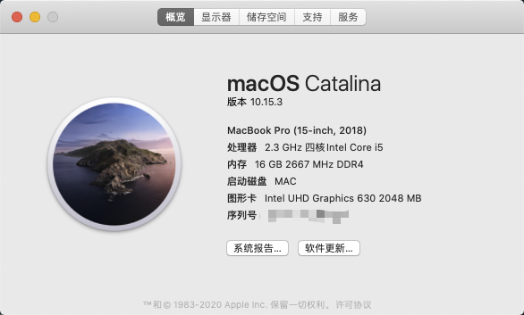

# XPS 9570 Hackintosh

## 配置

- CPU: i5 8300H
- Memory: 8G * 2 2666MHz DDR4
- Graphics: UHD 630
- Display: 1080P
- SSD: Hikvision c2000 pro
- Wi-Fi: Broadcom DW1820A
- OS: Catalina 10.15.3~10.15.5

使用3、4月，没什么毛病，除了有时候开机没有声音输出设备，重启即可解决

更新：

更新了Clover版本和部分驱动，声音问题解决，但是开机时会有杂音和一声爆破音，其余功能正常