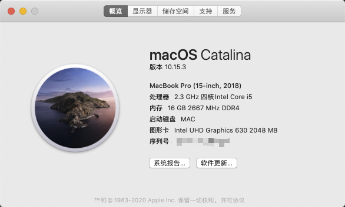

# XPS 9570 Hackintosh

## 配置

- CPU: i5 8300H
- Memory: 8G * 2 2666MHz DDR4
- Graphics: UHD 630
- Display: FHD
- SSD: Hikvision c2000 pro
- Wi-Fi: Broadcom DW1820A
- OS: Catalina 10.15.3~10.15.7
- OS: Big Sur 11.0.1




| 设备                                          | 状态   |
| --------------------------------------------- | ------ |
| 摄像头                                        | 正常   |
| 触控板                                        | 正常   |
| HDMI                                          | 正常   |
| 声音输入输出 （耳机）                         | 正常   |
| Type C 扩展坞 DELL DA300                      | 正常   |
| 睡眠 (鼠标与键盘不能唤醒，需按电源键才能唤醒) | 不正常 |

Big Sur 如果插入耳机没有声音，请在oc-for-bigsur > Tools > ComboJack 运行 install.sh，并重启

```shell
./install.sh
```

- [jaromeyer/XPS9570-CAtalina Issues #52](https://github.com/jaromeyer/XPS9570-Catalina/issues/52) Big Sur EFI来源

Thanks to frbuccoliero for providing EFI

